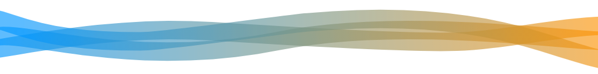

&nbsp;

# Lexakai &nbsp;&nbsp;

A tool for generating UML diagrams and markdown documentation indexes.

### Index

[**Dependencies**](#dependencies)  
[**Summary**](#summary)  
[**Example**](#example)  
[**Download Executable JAR**](#download-executable-jar)  
[**Creating Basic UML Package Diagrams**](#creating-basic-uml-package-diagrams)  
[**Custom UML Diagrams**](#custom-uml-diagrams)  
[**Grouping Methods in Class Diagrams**](#grouping-methods-in-class-diagrams)  
[**Automatic Method Groups**](#automatic-method-groups)  
[**UML Associations**](#uml-associations)  
[**Excluding Types And Members**](#excluding-types-and-members)  
[**Non-Public Apis**](#non-public-apis)  
[**Annotation Summary**](#annotation-summary)  
[**Configuration**](#configuration)  
[**Readme Generation and Updating**](#readme-generation-and-updating)  
[**Custom README Templates**](#custom-readme-templates)  
[**Class Diagrams**](#class-diagrams)  
[**Package Diagrams**](#package-diagrams)  
[**Javadoc**](#javadoc)

### Dependencies &nbsp;&nbsp; 

[*Dependency Diagram*](documentation/diagrams/dependencies.svg)

#### Maven Dependency

    <dependency>
        <groupId>com.telenav.lexakai</groupId>
        <artifactId>lexakai</artifactId>
        <version>0.9.3</version>
    </dependency>

[//]: # (start-user-text)

### Summary 

*Lexakai* - from lexis (greek for 'word') and kai (hawaiian for 'ocean').

Creates documentation indexes and UML diagrams from the source code of each maven or gradle  
project discovered recursively from the root folder(s) given as argument(s).

### Example 

For an example of Lexakai created documentation see [KivaKit](https://github.com/Telenav/kivakit).

### Download Executable JAR &nbsp; 

[Lexakai 0.9.3](tools/building/lexakai-0.9.3.jar)

### Creating Basic UML Package Diagrams &nbsp; 

Lexakai automatically creates basic package diagrams for all public types without further configuration.

### Custom UML Diagrams &nbsp; &nbsp; 

To create a set of one or more custom diagrams for a project, annotations can be used from this project:

    <dependency>
        <groupId>com.telenav.lexakai</groupId>
        <artifactId>lexakai-annotations</artifactId>
        <version>0.9.3</version>
    </dependency>

A class, annotation, enum or interface annotated with *@UmlClassDiagram(diagram = [marker-interface].class)*,  
where *[marker-interface]* extends the interface *UmlDiagramIdentifier*, will be included in the specified diagram.

For example, a type annotated with:

    @UmlClassDiagram(diagram = DiagramMapServer.class)

will be included in the diagram *diagram-map-server* (the lowercase, hyphenated name derived from  
the marker interface name). A type can be used in more than one diagram, by specifying more than one  
*@UmlClassDiagram* annotation:

    @UmlClassDiagram(diagram = DiagramMapServer.class)
    @UmlClassDiagram(diagram = DiagramServers.class)

The preferred location for diagram marker interfaces is in the sub-package *project.lexakai.diagrams*,  
and they should be prefixed with *Diagram* to make their use clear.

### Grouping Methods in Class Diagrams &nbsp; 

Groups of methods can be specified using the *@UmlMethodGroup* annotation. Method groups will  
be given labeled separators in class diagrams, making the list of methods easier to understand.

For example:

    @UmlMethodGroup("configuration")

could be used to label all the configuration-related methods in a type. Multiple *@UmlMethodGroup*  
annotations can be added to specify that a method should be shown in more than one group.

### Automatic Method Groups &nbsp;

The *@UmlMethodGroup* annotation can be avoided if the switch *-automatic-method-groups* is set to *true*  
(which is the default). In this case, the best guess will be made based on method name and parameter  
patterns as to which group a method most likely belongs. When the guess is inaccurate, or no guess is made,  
an *@UmlMethodGroup* annotation can be applied to correct the result. The set of patterns that are used to  
determine automatic groups is in a file called *lexakai.groups* in the documentation folder. This file can be  
customized for a particular project.

### UML Associations &nbsp; 

Patterns in the names of types, fields and methods are used to try to deduce UML associations.  
The annotation *@UmlRelation* can be used to override this guess with an explicit relation if the association  
was not be deduced, or it was deduced incorrectly.

If the annotation *@UmlRelation(label = \"*label*\")* is applied to a method or field, a relation arrow will  
be drawn from the enclosing type to the type of the member. Similar annotations are available for field  
aggregation (*@UmlAggregation*) and composition (*@UmlComposition*). If the *@UmlRelation* tag is applied to a  
type, it can specify a relation with a particular referent and cardinality. An explicit relation of this type  
can be made specific to a particular diagram with the *diagram* parameter. Multiple *@UmlRelation* tags can  
be applied to a type.

### Excluding Types And Members &nbsp;

Methods and fields can be excluded entirely by labeling them with *@UmlExcludeMember*.

### Non-Public Apis 

*@UmlNotPublicApi* marks a type or member as private even if it is not actually private.

### Annotation Summary &nbsp; 

    Diagrams:

           @UmlClassDiagram - declares the diagram(s) that the annotated type should be included in
            @UmlMethodGroup - includes the annotated method in a labeled method group in the diagram
                   @UmlNote - adds a callout note to a type or method

    Visibility:

      @UmlExcludeSuperTypes - excludes the listed supertypes from all diagrams
          @UmlExcludeMember - excludes the annotated member
          @UmlIncludeMember - includes the annotated member, even if it wouldn't normally be included
           @UmlNotPublicApi - marks the annotated type or member as private even if it is not

    Associations:

               @UmlRelation - adds a labeled UML relation from the enclosing type to the annotated member type
            @UmlAggregation - adds a UML aggregation association from the enclosing type to the annotated field type
            @UmlComposition - adds a UML composition association from the enclosing type to the annotated field type

### Configuration &nbsp; 

The *documentation* folder for each project should contain a *lexakai* folder with a *lexakai.properties* file that looks similar to this:

    #
    # Project
    #
    project-name         = my-project
    project-description  = This is my project.
    project-javadoc-url  = https://me.github.io/myproject/javadoc/myproject
    project-icon         = documentation/images/myproject.png
    project-footer       = Copyright by Me

    #
    # Diagram Titles
    #
    diagram-my-project   = My Project

The diagram name (the lowercase, hyphenated version of the marker interface) is used as a key to locate the title of the diagram. For
example:

    @UmlClassDiagram(diagram = DiagramMyProject.class)

refers to the diagram title specified by the key *diagram-my-project* in the *lexakai.properties* file.

### Readme Generation and Updating &nbsp; 

If the *-update-readme* switch is set to *true* (it is *false* by default to ensure it doesn't overwrite an  
existing file) then a *README.md* file will be generated or updated each time the UML diagrams are generated.  
This markdown file will use *project-name* as its title and insert the description *project-description*  
from the *lexakai.properties* file as the project description. An index of project diagrams is updated along with  
an index of any Javadoc at *project-javadoc-url* for all diagrammed types. Sections of documentation in the  
Javadoc will also be indexed based on the pattern specified by the switch *-javadoc-section-pattern*.  
By default, this pattern is:

    
<b>section-title</b>

which is the style used in the KivaKit.

Any text between the markdown comments *start-user-text* and *end-user-text* will be preserved,  
allowing additional documentation to be maintained.

### Custom README Templates 

The first run of Lexakai on a project will create two default templates in the *documentation* folder  
one for projects with source code and one for parent projects (projects with sub-projects). These  
template files can be modified to produce custom output. To revert to the default templates, simply  
remove them and run Lexakai again.

[//]: # (end-user-text)

### Class Diagrams &nbsp; &nbsp;

None

### Package Diagrams &nbsp;&nbsp;

[*com.telenav.lexakai*](documentation/diagrams/com.telenav.lexakai.svg)  
[*com.telenav.lexakai.associations*](documentation/diagrams/com.telenav.lexakai.associations.svg)  
[*com.telenav.lexakai.builders*](documentation/diagrams/com.telenav.lexakai.builders.svg)  
[*com.telenav.lexakai.builders.grouper*](documentation/diagrams/com.telenav.lexakai.builders.grouper.svg)  
[*com.telenav.lexakai.dependencies*](documentation/diagrams/com.telenav.lexakai.dependencies.svg)  
[*com.telenav.lexakai.indexes*](documentation/diagrams/com.telenav.lexakai.indexes.svg)  
[*com.telenav.lexakai.library*](documentation/diagrams/com.telenav.lexakai.library.svg)  
[*com.telenav.lexakai.members*](documentation/diagrams/com.telenav.lexakai.members.svg)  
[*com.telenav.lexakai.types*](documentation/diagrams/com.telenav.lexakai.types.svg)  

### Javadoc &nbsp;&nbsp;

Javadoc coverage for this project is 22.9%.  
  
&nbsp; &nbsp;  

The following significant classes are undocumented:  

- AssociationBuilder  
- LexakaiClassDiagram  
- MethodGroupNameGuesser  
- Types  
- UmlAssociation

| Class | Documentation Sections |
|---|---|
| [*Annotations*](https://telenav.github.io/lexakai/javadoc/lexakai.annotations/com/telenav/lexakai/library/Annotations.html) |  |  
| [*Artifact*](https://telenav.github.io/lexakai/javadoc/lexakai.annotations/com/telenav/lexakai/dependencies/Artifact.html) |  |  
| [*AssociationBuilder*](https://telenav.github.io/lexakai/javadoc/lexakai.annotations/com/telenav/lexakai/builders/AssociationBuilder.html) |  |  
| [*Associations*](https://telenav.github.io/lexakai/javadoc/lexakai.annotations/com/telenav/lexakai/library/Associations.html) |  |  
| [*BaseLexakaiDiagram*](https://telenav.github.io/lexakai/javadoc/lexakai.annotations/com/telenav/lexakai/BaseLexakaiDiagram.html) |  |  
| [*Dependency*](https://telenav.github.io/lexakai/javadoc/lexakai.annotations/com/telenav/lexakai/dependencies/Dependency.html) |  |  
| [*DependencyDiagram*](https://telenav.github.io/lexakai/javadoc/lexakai.annotations/com/telenav/lexakai/dependencies/DependencyDiagram.html) |  |  
| [*DependencyTree*](https://telenav.github.io/lexakai/javadoc/lexakai.annotations/com/telenav/lexakai/dependencies/DependencyTree.html) |  |  
| [*Diagrams*](https://telenav.github.io/lexakai/javadoc/lexakai.annotations/com/telenav/lexakai/library/Diagrams.html) |  |  
| [*Fields*](https://telenav.github.io/lexakai/javadoc/lexakai.annotations/com/telenav/lexakai/library/Fields.html) |  |  
| [*Lexakai*](https://telenav.github.io/lexakai/javadoc/lexakai.annotations/com/telenav/lexakai/Lexakai.html) |  |  
| [*LexakaiClassDiagram*](https://telenav.github.io/lexakai/javadoc/lexakai.annotations/com/telenav/lexakai/LexakaiClassDiagram.html) |  |  
| [*LexakaiClassDiagram.Referent*](https://telenav.github.io/lexakai/javadoc/lexakai.annotations/com/telenav/lexakai/LexakaiClassDiagram.Referent.html) |  |  
| [*LexakaiProject*](https://telenav.github.io/lexakai/javadoc/lexakai.annotations/com/telenav/lexakai/LexakaiProject.html) | Java Parsing |  
| | Functions |  
| | Settings |  
| [*LexakaiProject.JavadocCoverage*](https://telenav.github.io/lexakai/javadoc/lexakai.annotations/com/telenav/lexakai/LexakaiProject.JavadocCoverage.html) |  |  
| [*MavenDependencyTreeBuilder*](https://telenav.github.io/lexakai/javadoc/lexakai.annotations/com/telenav/lexakai/dependencies/MavenDependencyTreeBuilder.html) |  |  
| [*Members*](https://telenav.github.io/lexakai/javadoc/lexakai.annotations/com/telenav/lexakai/library/Members.html) |  |  
| [*MethodBuilder*](https://telenav.github.io/lexakai/javadoc/lexakai.annotations/com/telenav/lexakai/builders/MethodBuilder.html) |  |  
| [*MethodGroup*](https://telenav.github.io/lexakai/javadoc/lexakai.annotations/com/telenav/lexakai/builders/grouper/MethodGroup.html) |  |  
| [*MethodGroupNameGuesser*](https://telenav.github.io/lexakai/javadoc/lexakai.annotations/com/telenav/lexakai/builders/grouper/MethodGroupNameGuesser.html) |  |  
| [*MethodGrouper*](https://telenav.github.io/lexakai/javadoc/lexakai.annotations/com/telenav/lexakai/builders/grouper/MethodGrouper.html) |  |  
| [*MethodGroups*](https://telenav.github.io/lexakai/javadoc/lexakai.annotations/com/telenav/lexakai/builders/grouper/MethodGroups.html) |  |  
| [*Methods*](https://telenav.github.io/lexakai/javadoc/lexakai.annotations/com/telenav/lexakai/library/Methods.html) |  |  
| [*Names*](https://telenav.github.io/lexakai/javadoc/lexakai.annotations/com/telenav/lexakai/library/Names.html) |  |  
| [*Names.Qualification*](https://telenav.github.io/lexakai/javadoc/lexakai.annotations/com/telenav/lexakai/library/Names.Qualification.html) |  |  
| [*Names.TypeParameters*](https://telenav.github.io/lexakai/javadoc/lexakai.annotations/com/telenav/lexakai/library/Names.TypeParameters.html) |  |  
| [*ReadMeUpdater*](https://telenav.github.io/lexakai/javadoc/lexakai.annotations/com/telenav/lexakai/indexes/ReadMeUpdater.html) | Usage |  
| | Templates |  
| [*TypeBuilder*](https://telenav.github.io/lexakai/javadoc/lexakai.annotations/com/telenav/lexakai/builders/TypeBuilder.html) |  |  
| [*Types*](https://telenav.github.io/lexakai/javadoc/lexakai.annotations/com/telenav/lexakai/library/Types.html) |  |  
| [*UmlAssociation*](https://telenav.github.io/lexakai/javadoc/lexakai.annotations/com/telenav/lexakai/associations/UmlAssociation.html) |  |  
| [*UmlAssociation.AssociationType*](https://telenav.github.io/lexakai/javadoc/lexakai.annotations/com/telenav/lexakai/associations/UmlAssociation.AssociationType.html) |  |  
| [*UmlConstructor*](https://telenav.github.io/lexakai/javadoc/lexakai.annotations/com/telenav/lexakai/members/UmlConstructor.html) |  |  
| [*UmlInheritance*](https://telenav.github.io/lexakai/javadoc/lexakai.annotations/com/telenav/lexakai/associations/UmlInheritance.html) |  |  
| [*UmlMethod*](https://telenav.github.io/lexakai/javadoc/lexakai.annotations/com/telenav/lexakai/members/UmlMethod.html) |  |  
| [*UmlType*](https://telenav.github.io/lexakai/javadoc/lexakai.annotations/com/telenav/lexakai/types/UmlType.html) |  |  

[//]: # (start-user-text)

[//]: # (end-user-text)

 

Copyright &#169; 2011-2021 [Telenav](http://telenav.com), Inc. Distributed under [Apache License, Version 2.0](LICENSE)  
This documentation was generated by [Lexakai](https://github.com/Telenav/lexakai) on 2021.04.09. UML diagrams courtesy
of [PlantUML](http://plantuml.com).

